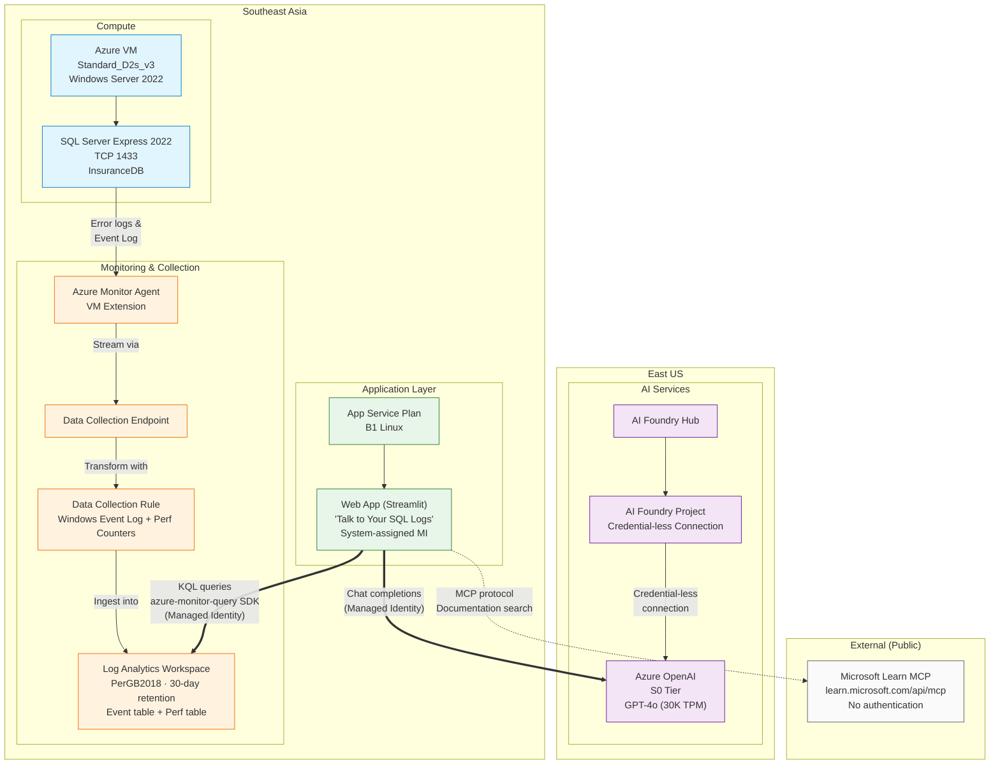
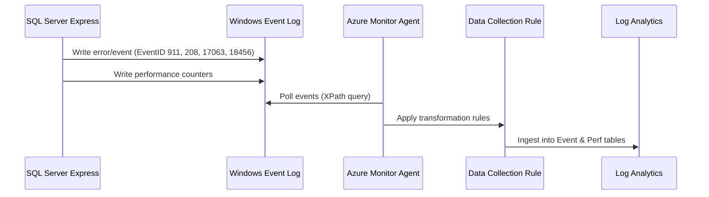
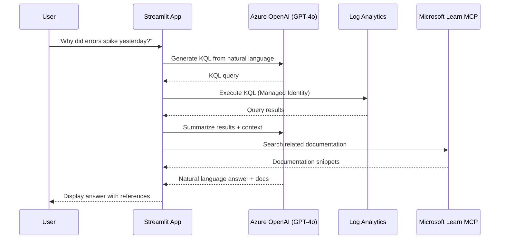
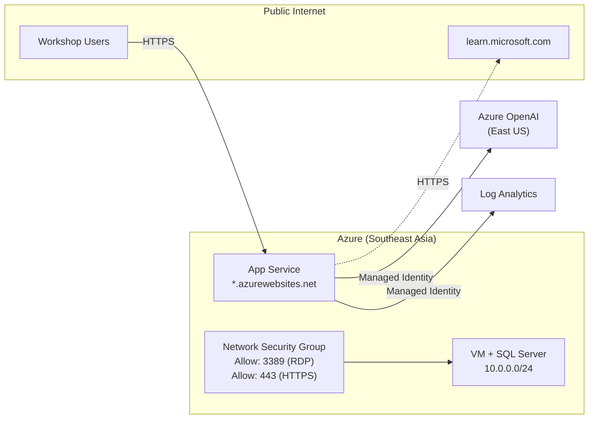

# Architecture
{: .fs-9 }

Understand the system design, Azure resource relationships, and data flows.
{: .fs-6 .fw-300 }

---

## Resource Topology

---

## Resource Inventory

| # | Resource | Type | Region | Key Config |
|---|---|---|---|---|
| 1 | `rg-contoso-sqlobs` | Resource Group | Southeast Asia | — |
| 2 | `law-contoso-sqlobs` | Log Analytics Workspace | Southeast Asia | PerGB2018, 30-day retention |
| 3 | `vm-sql-sea-01` | Virtual Machine | Southeast Asia | D2s_v3, Windows 2022, System MI |
| 4 | Data Collection Endpoint | DCE | Southeast Asia | Linked to VM |
| 5 | `dcr-sql-windows-logs` | Data Collection Rule | Southeast Asia | Event Log + Perf Counters |
| 6 | DCR Association | Association | Southeast Asia | VM → DCR |
| 7 | `aoai-contoso-sqllogs` | Azure OpenAI | East US | S0, GPT-4o 30K TPM |
| 8 | `ai-hub-contoso` | AI Foundry Hub | East US | — |
| 9 | `ai-proj-sqllogs` | AI Foundry Project | East US | Credential-less OpenAI connection |
| 10 | `app-contoso-sqllogs` | App Service (Web App) | Southeast Asia | B1 Linux, System MI |

---

## Data Flows

### Log Collection Flow

### Query Flow (Runtime)

---

## Security Model

| Principle | Implementation |
|---|---|
| No secrets in app settings | Managed Identity replaces API keys |
| Least privilege RBAC | `Cognitive Services OpenAI User` + `Log Analytics Reader` |
| System-assigned identity | Lifecycle tied to App Service |
| No credentials in code | `DefaultAzureCredential` for all tokens |
| HTTPS enforced | App Service TLS by default |

### RBAC Assignments

| Principal | Role | Scope |
|---|---|---|
| Web App MI | Cognitive Services OpenAI User | Azure OpenAI account |
| Web App MI | Log Analytics Reader | Log Analytics Workspace |

---

## Network Architecture

---

## Infrastructure Scripts

The deployment is orchestrated by `deploy.sh` which provisions resources in order:

| Step | Script Section | Resources |
|---|---|---|
| 1 | `[1/7]` | Resource Group |
| 2 | `[2/7]` | Log Analytics Workspace |
| 3 | `[3/7]` | Windows VM + System MI |
| 4 | `[4/7]` | AMA + DCE + DCR + Association |
| 5 | `[5/7]` | Azure OpenAI + GPT-4o deployment |
| 6 | `[6/7]` | AI Foundry Hub + Project + Connection |
| 7 | `[7/7]` | App Service Plan + Web App + MI + RBAC |

{: .important }
> Steps 5–6 deploy to **East US** (Azure OpenAI availability). All other resources are in **Southeast Asia**.

---

[← Prerequisites]({{ site.baseurl }}){: .btn .btn-outline .fs-5 .mb-4 .mb-md-0 .mr-2 }
[Next: Deploy Infrastructure →]({{ site.baseurl }}){: .btn .btn-primary .fs-5 .mb-4 .mb-md-0 }
