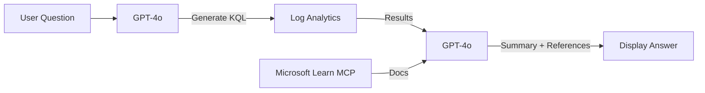

# Module 6 — Deploy the AI App
{: .fs-8 }

Deploy the Streamlit application that provides natural language queries over SQL Server logs.
{: .fs-5 .fw-300 }

---

## Application Components

| File | Purpose |
|---|---|
| `streamlit-app/app.py` | Main Streamlit UI — chat interface for log queries |
| `streamlit-app/kql_prompt.py` | GPT-4o prompt engineering + KQL generation |
| `streamlit-app/learn_search.py` | Microsoft Learn MCP integration for documentation |
| `streamlit-app/requirements.txt` | Python dependencies |

---

## How It Works



1. User types a natural language question about SQL logs
2. GPT-4o generates a KQL query based on table schemas in `kql_prompt.py`
3. Query executes against Log Analytics via `azure-monitor-query` SDK
4. Results are summarized by GPT-4o with Microsoft Learn references
5. All authentication uses **Managed Identity** — no API keys

---

## Deploy: ZIP Deploy (Simplest)

```bash
cd streamlit-app
zip -r ../deploy.zip . -x "*.pyc" "__pycache__/*" ".env"

az webapp deploy \
  --resource-group "$RESOURCE_GROUP" \
  --name "$WEBAPP_NAME" \
  --src-path ../deploy.zip \
  --type zip

cd ..
rm deploy.zip
```

---

## Deploy: GitHub Actions CI/CD

1. Get the publish profile:
   ```bash
   az webapp deployment list-publishing-profiles \
     --resource-group "$RESOURCE_GROUP" \
     --name "$WEBAPP_NAME" --xml
   ```
2. Store as GitHub secret `AZURE_WEBAPP_PUBLISH_PROFILE`
3. Use [Azure/webapps-deploy](https://github.com/Azure/webapps-deploy) action

---

## Verify Deployment

```bash
curl -s -o /dev/null -w "%{http_code}" "https://${WEBAPP_NAME}.azurewebsites.net"
# Expected: 200

az webapp log tail \
  --resource-group "$RESOURCE_GROUP" \
  --name "$WEBAPP_NAME" \
  --timeout 30
```

---

## Troubleshooting

| Symptom | Check | Fix |
|---|---|---|
| HTTP 500 | App logs | `az webapp log tail -g $RESOURCE_GROUP -n $WEBAPP_NAME` |
| `DefaultAzureCredential` fails | MI not enabled | Verify `principalId` on webapp identity |
| `AuthorizationFailed` to OpenAI | RBAC | Re-run RBAC from deploy.sh Step 7 |
| `ModuleNotFoundError` | Code not deployed | Deploy using ZIP deploy above |
| No doc snippets | Network | Ensure outbound to `learn.microsoft.com` |

---

[← Simulate Errors]({{ site.baseurl }}){: .btn .btn-outline .fs-5 .mb-4 .mb-md-0 .mr-2 }
[Next: Production & Cleanup →]({{ site.baseurl }}){: .btn .btn-primary .fs-5 .mb-4 .mb-md-0 }
